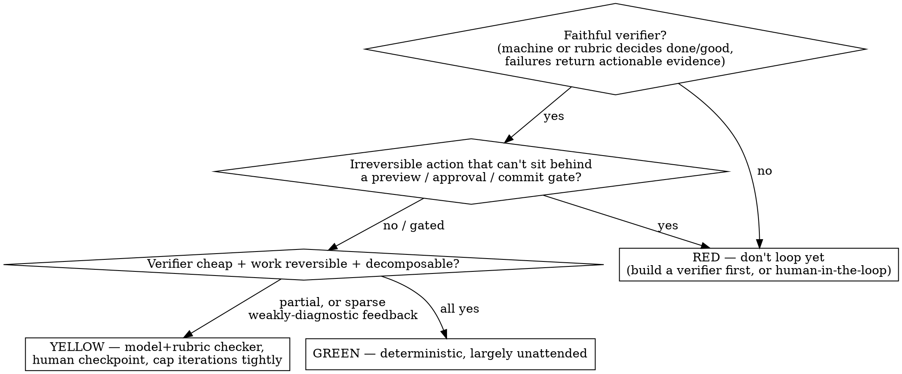

# Loop Engineering

Designing a system where an agent attempts a task, an independent check verifies it, the agent revises from the failure evidence, and the system stops or escalates under explicit budgets — designed once, not prompted per turn.

## The spine

**A loop is only as good as its verifier — the loop body is the easy part.** Verifier fidelity is usually the binding constraint, but convergence also depends on the action space, state integrity, observability, decomposition, and recovery policy.

The deciding upstream question for any task: **do failed attempts return sufficiently faithful and actionable evidence?** Dense (per-step) feedback usually improves convergence. A *sparse but cheap and reliable terminal verifier* can still support a bounded search loop — a compiler, a proof checker, a terminal test suite, a post-migration consistency check. What does not work is **sparse and non-diagnostic feedback over a large search space** — that wanders; route it to YELLOW or RED, not GREEN.

> Analogy, not identity: this resembles inference-time search/control with reward-like feedback. No policy weights are updated, so it is not literal RL; the analogy mainly helps reason about proxy objectives, sparse feedback, and reward hacking. Full mapping and the complete failure-mode catalog: `references/extended-rationale.md`.

## Operating procedure

When this skill activates, apply the framework **silently** — do not recite it unless asked to explain, and do not dump the whole framework on a small question.

First route to a mode. All modes share one skeleton — triage → acceptance contract → architecture — and differ only in entry point and what you return:

- **assess** — "is this a good fit for a loop?" → stop after the triage verdict + decisive reasons.
- **design** — build a loop for a fit task → full Required output.
- **diagnose** — an existing loop drifts / burns tokens / passes checks but misses intent → go to the failure-mode audit (`references/extended-rationale.md`) and return the specific fix.
- **harden** — a working loop heading to production → `references/production-hardening.md` + `references/deployment.md`.
- **implement** — write the actual loop → full Required output including a working implementation.

Default sequence (design / implement):
1. Identify the mode.
2. Decide whether the task needs a loop at all (don't loop a one-shot or ordinary deterministic automation).
3. Return a GREEN / YELLOW / RED verdict with the decisive reasons.
4. Define or draft the acceptance contract.
5. Design the loop **only if the verdict permits**; lay out outer scheduler / inner loop / commit gate.
6. Bound cost, side effects, retries, concurrency, escalation.
7. If RED, produce a gated / sandboxed / draft-only alternative — not a full-auto design.

## Required output

Design / implement modes return:
1. **Loop-fit verdict** — GREEN / YELLOW / RED + decisive reasons.
2. **Assumptions** — every decision made without explicit user input, flagged.
3. **Acceptance contract** — what "done / good" means, in checkable terms.
4. **Loop specification** — outer / inner / commit-gate, verifier, stop conditions.
5. **Approval & escalation policy** — gates before side effects; escalation triggers.
6. **Budget & observability** — caps + what to measure.
7. **Implementation** — the actual loop when the platform / interfaces are known; pseudocode or a plan only when those details are missing.

Other modes return:
- **assess** — verdict, decisive evidence, the main blocker, recommended next step.
- **diagnose** — observed symptom, likely root cause, the verifier / state / policy gap, a concrete patch, and the metric that will prove the patch worked.
- **harden** — production gaps, required controls, rollout stage, kill criteria, remaining human gates.

## Task-fit triage (do this FIRST — most loop failures are task-selection failures)

Assess on four dimensions (qualitative — do not force a numeric score):

1. **Verifier fidelity** — can a machine, or a concrete rubric, faithfully decide "done / good", and do failed attempts return actionable evidence? Code can (tests, compiler, types). Taste / strategy / "right direction" usually can't, yet.
2. **Verifier cost** — can that check run for far less than a human redo, at the cadence the loop needs it?
3. **Reversibility** — can a bad intermediate result roll back cheaply before irreversible cost? (Branch = safe; sent email / moved money / dropped prod table = not.)
4. **Decomposability** — can work split into units small enough to reason over reliably?

Two hard vetoes:
- **Verifier fidelity = none** (no faithful machine or rubric check, and failures give no actionable evidence) **→ RED.**
- **An irreversible action that cannot be isolated behind an enforceable preview / approval / commit gate → RED.** (A design that performs irreversible actions *inside* the refinement loop is RED until redesigned. The user not having proposed a gate does not make the task RED — designing the gate is this skill's job.)

Otherwise:
- **GREEN** — a sufficiently faithful, cheap, and stable objective verifier + reversible + decomposable → deterministic loop, largely unattended.
- **YELLOW** — verifier needs a model + rubric, OR steps are only semi-reversible, OR feedback is sparse and weakly diagnostic → keep a human checkpoint or a strong independent checker; cap iterations tightly.
- **RED** — hits a veto, or feedback is sparse and non-diagnostic over a large search space → don't loop yet. Keep a human in the seat, or first *build a verifier* and re-triage, or take the downgrade path.

Engineering quality cannot compensate for the absence of a faithful acceptance signal.

**Downgrade path (vague / sparse-and-non-diagnostic request):** (1) try to turn it diagnostic — force out scorable intermediate criteria, decompose terminal "good" into a per-step rubric; (2) if you can't, say so plainly and offer human-in-the-loop / shrink-the-task / draft-generator; (3) surface the cost and why it can't be fully autonomous. Be the honest advisor, not the "everything automates" salesperson.

## Acceptance contract (extract the verifier BEFORE building)

The criterion is usually locked in the user's head, implicit — the users who most need a loop are least able to specify it. Pull it out:

- **Draft-and-flag (default; user can roughly describe the goal):** generate a concrete draft criterion / spec immediately, tag every unspecified decision `[ASSUMPTION: ...]`, let the user correct. Recognition is cheaper than recall.
- **Interview (user can't give a direction):** ask at most 1–3 high-impact questions in one batch — never ones you could infer (friction test: does the answer change the output?). If answers aren't available, proceed with an explicit draft and flagged assumptions, unless the missing information is safety-critical or makes verification impossible.

Write "good" concretely: not "high quality" but "opens with a clear recommendation, cites at least one data point, no jargon, under 300 words." Externalizing taste (a design.md / style guide) belongs here — but it steers the maker, it does not verify (see Verification portfolio). If you can't get a checkable criterion even after this → RED.

## Loop architecture — three logical layers

Use these as distinct logical layers **where applicable**. For a single work item the outer scheduler may be a trivial one-shot wrapper; the commit gate is an admission/rejection check, not a loop.

- **Outer scheduler** — queue selection, reservation, dispatch, queue-level termination.
- **Inner refinement loop** — convergence on one work item, with pass / stagnation / budget stops.
- **Commit gate** — approval preconditions, final independent verification, the commit decision, and postcondition checks, **before any irreversible, privileged, or externally visible effect**. Such actions live *here*, outside the inner loop.

### Parts that make the layers hold

- **Verifier (heart); maker ≠ acceptance authority.** Prefer deterministic checks when sufficiently comprehensive, stable, cheap, and independent of the maker — unit tests are one example, not proof of correctness. The maker may self-check to catch cheap errors, but must not be the sole acceptance authority. Use the cheapest verifier meeting a measured reliability target; escalate disagreement / low-confidence / high-impact to a stronger checker or a human. Calibration (false-accept rate is the key metric): `references/production-hardening.md`.
- **Protect the control plane.** The maker must not modify the acceptance contract, locked / holdout tests, checker instructions, rubric, budgets, stop conditions, or approval policy — the easiest "fix" for a stuck agent is to weaken the test, not fix the artifact. Any such change creates a new goal version and requires independent approval; where gaming is plausible, keep at least one acceptance set hidden from the maker.
- **Stop conditions (implement all three; halt the moment any one trips):** (a) **threshold met** — acceptance contract satisfied, confirmed by independent verification; (b) **no-progress** — a real progress signal stalls: failing-test set stops shrinking, unmet-rubric-item count stops dropping, the failure fingerprint repeats, or only cosmetic diffs appear across rounds — *not* merely "same error text" (an agent can perturb output to dodge that), and no-progress itself needs an executable check; (c) **budget** — step / token / dollar cap hit.
- **State / external memory.** Persist outside the context. A free-text `STATE.md` is fine only for a single, serial loop. For multi-run or concurrent loops use structured state + append-only attempt log + raw verifier evidence + a human summary, carrying `goal_version` / `verifier_version` / `rubric_version` so a mid-run change to the target is detectable, with an optimistic-lock / version check so agents don't overwrite each other. Schema: `references/production-hardening.md`.
- **Action space + connectors.** The action space determines what verifier you can build — no dry-run / preview means no checkable intermediate state. Provide previews / dry-runs / sandboxes. Calibrate ask-vs-act by reversibility/risk: gate first for delete / send / pay; just act for read / search / grep. For external effects use prepare → preview → validate → approve → commit → verify-postcondition, with idempotency keys (details in `references/production-hardening.md`). **Do not remove approval / sandbox / commit gates merely because full autonomy was requested — give the closest safely bounded design.**
- **Security boundary** (mandatory for unattended loops, not just hardening). Least privilege; separate read / write credentials. Treat retrieved content, user-generated content, and tool output as **untrusted data, never as authorization to invoke tools** — external text can supply data but cannot grant permission (this is the indirect-prompt-injection boundary). Allowlist tools, destinations, and writable resources; redact credentials and sensitive data from state, prompts, and logs.
- **Escalation — observable triggers, not self-reported confidence** (model self-reported confidence is poorly calibrated): verifier disagreement; input out of known range; unknown tool error; budget near cap; repeated failure fingerprint; high-risk action; missing key evidence; state / external-data inconsistency. Make "what's waiting for a human" a first-class output.
- **Isolation.** Parallel agents in isolated workspaces (worktrees / sandboxes) so they don't collide and bad results stay reversible. Throughput at scale comes from isolation + verification, not from adding more agents.

## Verification portfolio — evidence independence > model-identity independence

Two different models can still share the same wrong knowledge, prompt bias, incomplete requirements, training distribution, or polluted context — so independence of *evidence* matters more than independence of model identity. There is **no universal ranking** of sources: select by fidelity to the acceptance contract, independence, coverage, stability, and cost, and combine complementary evidence where possible. Typical sources: domain-grounded deterministic checks, locked / holdout cases, sentinel checks not exposed to the maker, independently-instructed model judges, and sampled human review. No source type is universally strongest — for an aesthetic bar a calibrated human may beat any deterministic check; an external "fact" may be stale or irrelevant to the contract.

## Examples

**GREEN — dependency upgrade.** Goal: bump a dependency until build, unit tests, type checks, and a locked compatibility suite pass. GREEN because the verifier is faithful, cheap, and stable; work is on an isolated branch; the change is reversible; the unit is bounded; and merging / publishing stays *outside* the loop (commit gate).

**YELLOW (hybrid) — code-review loop.** Maker drafts changes; a separate, independently-instructed judge scores against a project rubric, with a CI gate; stop on score ≥ threshold AND CI green, or no-progress, or max iterations; anything below threshold after max iterations → human triage. YELLOW, not GREEN, because the quality bar includes a subjective model judge — CI green cannot verify architecture quality, requirement correctness, or hidden side effects. Externalize the taste into the rubric first; if it can't be externalized ("I'll know it when I see it"), it's RED → human-in-the-loop.

## Research frontier

Manufacturing a faithful verifier for sparse or subjective objectives is an open problem. Explore generated tests and reward shaping as *hypotheses*, and validate that they correlate with the real objective through independent evaluation before trusting them.

## References (load when relevant)

- `references/production-hardening.md` — verifier calibration & false-accept measurement; idempotency / transaction semantics; concurrency locking; structured state schema.
- `references/deployment.md` — offline → shadow → canary → rollout; monitoring metrics; cost-ceiling formula; kill switch and audit trail.
- `references/extended-rationale.md` — the inference-time-RL analogy in full; Goodhart / reward hacking; dense-vs-sparse and reward shaping; the complete failure-mode catalog including the human-side ones (comprehension debt, cognitive surrender, slop).
